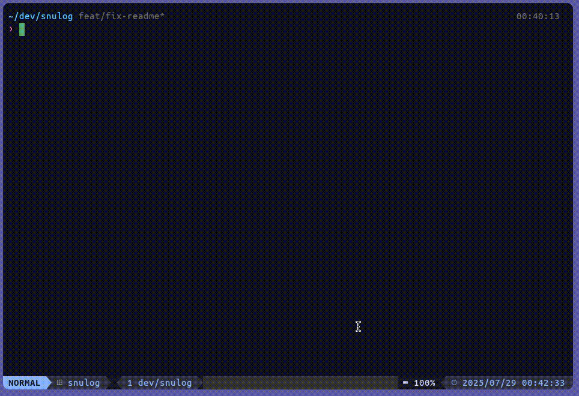
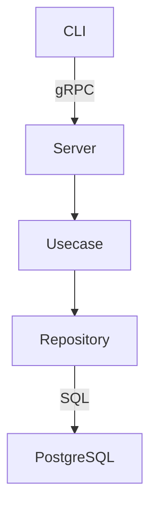

# snulog



snulogは`Scrum開発におけるメンバーの進捗・感情ログをCLIで素早く記録・取得できるGo製ツール`です。
gRPC + Clean Architecture + CI整備により実務を想定した構成になっています。

## 特徴

- gRPCを用いたマイクロサービス通信
- Postgres + golang-migrate によるDB管理
- 自動テスト + GitHub Actions CI整備
- golangci-lint による静的解析
- CLI / TUI (予定)

## 使用技術

| 分類 | 技術 |
|------|------|
| 言語 | Go 1.24 |
| DB | PostgreSQL |
| Migration | golang-migrate |
| CI | GitHub Actions |
| Linter | golangci-lint |
| Arch | Clean Architecture（cmd / usecase / repo） |
| その他 | Docker Compose, Makefile |

## アーキテクチャ
<details>
<summary>マーメイド図</summary>

</details>

## CI バッジ


 <!-- 仮数字 -->

## 🔧 開発環境セットアップ

```sh
make dev     # docker compose up --build
make migrate-up
make run-fetch
make run-add
```

## 📷 使い方（例）

```sh
# ログ追加
go run main.go add "チケット#123" "進捗よし" "体調まずまず"

# ログ取得
go run main.go fetch
```

## 📁 ディレクトリ構成（抜粋）

```
.
├── cmd/            # CLI コマンド群
├── server/         # gRPC サーバ
├── internal/
│   ├── usecase/    # ビジネスロジック
│   └── repository/ # データ操作
├── proto/          # gRPC定義
├── Dockerfile
├── docker-compose.yml
```

## 🧱 今後の予定

- [ ] TUI化（BubbleTea）
- [ ] gRPC streaming 対応
- [ ] 並列処理対応（fan-out fetch）
- [ ] OpenTelemetry導入
